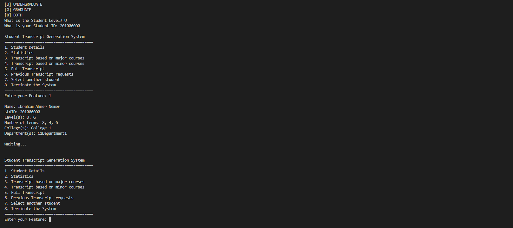

# 📌 Student Transcript System

## 🛠 Tech Stack


## 📄 Description

The Student Transcript Generation System is a command-line-based final project developed for the Data Structures and Algorithms course. It allows users to generate a CSV transcript file for students by providing options such as viewing student details, course-based transcripts (major/minor), overall statistics, and previously generated transcript records. The menu-driven system helps streamline academic data management and improves usability for faculty or administrative use.

## 🚀 How to Use

1. Clone the repository:

   ```bash
   git clone https://github.com/KyneLaggui/student-transcript-dsa.git
   ```

2. Navigate into the project folder:

   ```bash
   cd student-transcript-dsa
   ```

3. Run the application:
   ```bash
   python DSAFinalProjectGroup4.py
   ```

> ✅ Make sure Python is installed on your machine. No external dependencies required.

## 🤝 Collaborators

| Name                | GitHub                                     |
| ------------------- | ------------------------------------------ |
| Kyle Carandang      | [@kylekrc](https://github.com/kylekrc)     |
| Justin Carl de Guia | [@Rodskov](https://github.com/Rodskov)     |
| William Elumba      | [@wjrelumba](https://github.com/wjrelumba) |

## 🖼 Photo Documentations

| Screenshot                                          | Description         |
| --------------------------------------------------- | ------------------- |
|  | Main Menu Interface |
